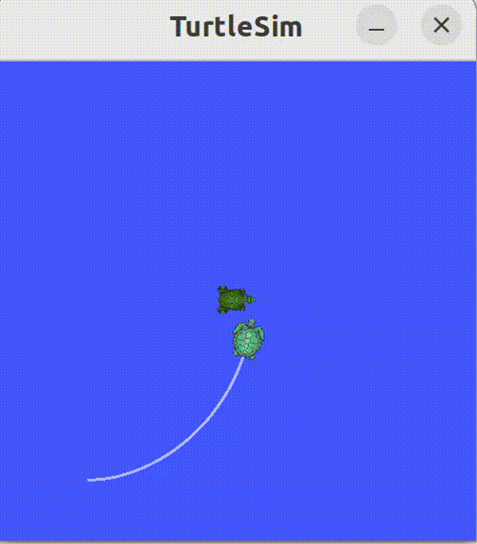

# ROS2 Turtle Following (TF-based)

## 项目介绍

基于 ROS2 TF 坐标变换，实现一个乌龟自动跟随系统。
通过监听 turtle1 与 turtle2 的相对位姿，实时生成速度控制指令，使 turtle2 平滑跟随 turtle1。

---

## 功能特点

* 基于 TF 实现坐标系转换（world → turtle）
* 使用 TransformListener 获取相对位姿
* 基于比例控制（P控制）实现跟随
* 支持参数调节：

  * 跟随距离（stop_distance）
  * 线速度增益（linear_gain）
  * 角速度增益（angular_gain）
* 限制最大速度，提升稳定性（防抖）

---

## 技术点

* ROS2 节点通信
* TF2 坐标变换（TransformBroadcaster / Listener）
* 几何计算（atan2 / 距离计算）
* 简单控制算法（P控制）

---

## 运行方式

```bash
ros2 launch py05_exercise exer01_turtle_follow.launch.xml
```

```bash
ros2 run turtlesim turtle_teleop_key
```

---

## 效果展示



---

## 项目结构

```
src/py05_exercise/
```

---

## 后续优化方向

* PID 控制优化
* 多目标跟随
* RViz 可视化
